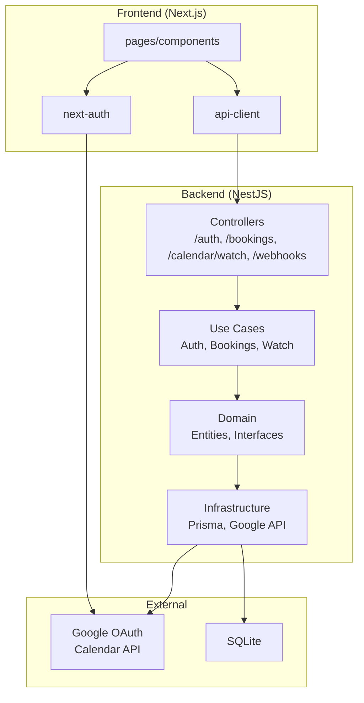
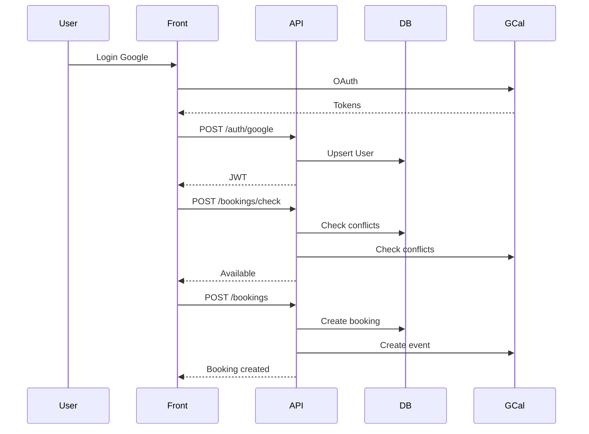
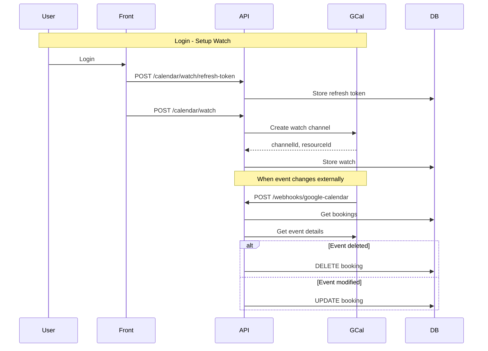

# Booking System - Documentation

---

## 1. Project Overview

A robust booking solution designed to prevent double-bookings by performing real-time availability checks against both a **local database** and **Google Calendar**.

### Core Features

| Feature                 | Description                                                                                                                                      |
| ----------------------- | ------------------------------------------------------------------------------------------------------------------------------------------------ |
| **Google Login**        | Secure OAuth 2.0 authentication via next-auth (v5). Users sign in with their Google account.                                                     |
| **Conflict Prevention** | Dual-layer verification (DB + GCal) before finalizing any booking. Checks both sources in parallel.                                              |
| **Create Booking**      | Full booking creation flow with availability check first, then confirmation. Creates reservation in local DB and syncs event to Google Calendar. |
| **List Bookings**       | Display all user bookings in list and calendar views. Shows upcoming and past reservations with details like title, time, and duration.          |
| **Cancel Booking**      | Remove booking from both local database and Google Calendar. Verifies ownership before deletion.                                                 |
| **Calendar View**       | Interactive UI (Day/Week/Month) built with Tailwind CSS. Google Calendar-like experience.                                                        |
| **Bi-directional Sync** | Webhooks/Watch system to detect external changes in Google Calendar. Local DB stays synchronized when events are modified directly in GCal.      |
| **Auto-Renewal**        | Cron jobs refresh Google "Watch" channels every 12 hours. Maintains continuous sync as watches expire after ~1 week.                             |
| **Token Management**    | Automatic access token refresh when expired. Uses Google's refresh tokens to obtain new access tokens without user re-authentication.            |
| **CI/CD Pipeline**      | GitHub Actions workflow for automated testing and deployment. Runs linting, type checking, and tests on every pull request.                      |

---

## 2. What is a Monorepo?

A **monorepo** is a single repository containing multiple independent projects.

### Advantages

- **Code sharing** between projects
- **Single dependency** configuration
- **Integrated development** frontend + backend
- **Simplified CI/CD**

### Project Structure

```
booking-system/                    # Monorepo root
├── apps/                         # Applications
│   ├── api/                      # Backend (NestJS)
│   │   ├── prisma/              # Database
│   │   └── src/                # Source code
│   │
│   └── web/                      # Frontend (Next.js)
│       └── src/                # Source code
│
├── docs/                         # Documentation
├── package.json                  # Workspace scripts
├── pnpm-workspace.yaml          # pnpm config
└── turbo.json                  # Turborepo config
```

---

## 3. Backend Structure (NestJS)

```
apps/api/src/
├── domain/                       # Inner layer - no external dependencies
│   ├── entities/
│   │   ├── user.entity.ts       # User
│   │   ├── booking.entity.ts   # Booking
│   │   └── calendar-watch.entity.ts  # Calendar Watch
│   │
│   └── repositories/            # Interfaces (ports)
│       ├── user.repository.interface.ts
│       ├── booking.repository.interface.ts
│       └── calendar-watch.repository.interface.ts
│       └── services/
│           ├── calendar.service.interface.ts
│           └── calendar-watch.service.interface.ts
│
├── application/                  # Use cases - business logic
│   ├── use-cases/
│   │   ├── auth/
│   │   │   └── google-auth.use-case.ts
│   │   ├── bookings/
│   │   │   ├── check-availability.use-case.ts
│   │   │   ├── create-booking.use-case.ts
│   │   │   ├── get-user-bookings.use-case.ts
│   │   │   └── cancel-booking.use-case.ts
│   │   └── calendar-watch/
│   │       ├── create-watch.use-case.ts
│   │       ├── handle-webhook.use-case.ts
│   │       └── store-refresh-token.use-case.ts
│   │       └── watch-renewal.cron.ts
│   │
│   └── dtos/                   # Data Transfer Objects
│
├── infrastructure/               # External adapters
│   ├── persistence/
│   │   └── prisma/            # Repository implementations
│   │       ├── prisma.service.ts
│   │       ├── prisma-user.repository.ts
│   │       ├── prisma-booking.repository.ts
│   │       └── prisma-calendar-watch.repository.ts
│   │
│   ├── google-calendar/        # Google adapter
│   │   ├── google-calendar.service.ts
│   │   └── google-calendar-watch.service.ts
│   │
│   └── http/                   # REST controllers
│       ├── controllers/
│       │   ├── auth.controller.ts
│       │   ├── bookings.controller.ts
│       │   ├── calendar-watch.controller.ts
│       │   └── webhook.controller.ts
│       ├── guards/
│       ├── strategies/
│       └── decorators/
│
└── modules/                    # NestJS modules (DI)
    ├── prisma.module.ts
    ├── auth.module.ts
    ├── bookings.module.ts
    └── calendar-watch.module.ts
```

---

## 4. Frontend Structure (Next.js)

```
apps/web/src/
├── app/                        # App Router (Next.js 14)
│   ├── page.tsx              # Landing - Login
│   ├── layout.tsx            # Root layout
│   ├── dashboard/
│   │   ├── page.tsx         # Dashboard (SSR)
│   │   └── dashboard-client.tsx  # Client component
│   └── api/auth/[...nextauth]/
│       └── route.ts          # next-auth handler
│
├── components/
│   └── bookings/
│       ├── booking-form.tsx  # Create booking form
│       ├── booking-list.tsx  # Booking list
│       └── booking-calendar.tsx # Calendar view
│
├── lib/
│   ├── auth.ts               # next-auth configuration
│   └── api-client.ts        # Typed API client
│
└── types/
    └── next-auth.d.ts        # Type extensions
```

---

## 5. Database Structure (Prisma)

### Models

```prisma
model User {
  id                 String         @id @default(cuid())
  email              String         @unique
  name               String?
  googleId           String         @unique
  pictureUrl         String?
  googleRefreshToken String?        # For server-side API calls
  createdAt          DateTime       @default(now())
  updatedAt          DateTime       @updatedAt
  bookings           Booking[]
  calendarWatch      CalendarWatch?
}

model Booking {
  id            String   @id @default(cuid())
  title         String
  startTime     DateTime
  endTime       DateTime
  googleEventId String?  # Event ID in Google Calendar
  userId        String
  user          User     @relation(fields: [userId], references: [id], onDelete: Cascade)
  createdAt     DateTime @default(now())
  updatedAt     DateTime @updatedAt

  @@index([userId])
  @@index([startTime, endTime])
}

model CalendarWatch {
  id           String   @id @default(cuid())
  userId       String   @unique
  channelId    String   @unique   # Google channel ID
  resourceId   String            # Resource ID
  channelToken String             # Verification token
  expiration   DateTime          # Expires ~1 week
  createdAt    DateTime @default(now())
  updatedAt    DateTime @updatedAt
  user         User     @relation(fields: [userId], references: [id], onDelete: Cascade)
}
```

### Relationships

```
User 1──→ Booking
User 1──→ CalendarWatch
```

---

## 6. API Endpoints

### Authentication

| Method | Endpoint       | Description                      |
| ------ | -------------- | -------------------------------- |
| POST   | `/auth/google` | Exchange Google ID token for JWT |

**Request:**

```json
{ "idToken": "eyJhbGciOiJSUzI1NiIs..." }
```

**Response:**

```json
{
  "accessToken": "eyJhbGciOiJIUzI1NiIs...",
  "user": { "id": "...", "email": "...", "name": "..." }
}
```

---

### Bookings

| Method | Endpoint          | Description        | Auth       |
| ------ | ----------------- | ------------------ | ---------- |
| POST   | `/bookings/check` | Check availability | Bearer JWT |
| POST   | `/bookings`       | Create booking     | Bearer JWT |
| GET    | `/bookings`       | List bookings      | Bearer JWT |
| DELETE | `/bookings/:id`   | Cancel booking     | Bearer JWT |

**POST /bookings/check - Request:**

```json
{
  "startTime": "2025-03-15T10:00:00Z",
  "endTime": "2025-03-15T11:00:00Z",
  "googleAccessToken": "...",
  "googleRefreshToken": "..."
}
```

**Response:**

```json
{
  "available": true,
  "dbConflicts": [],
  "calendarConflicts": []
}
```

---

### Calendar Watch

| Method | Endpoint                        | Description         | Auth       |
| ------ | ------------------------------- | ------------------- | ---------- |
| POST   | `/calendar/watch/refresh-token` | Store refresh token | Bearer JWT |
| POST   | `/calendar/watch`               | Create watch        | Bearer JWT |

---

### Webhooks

| Method | Endpoint                    | Description          |
| ------ | --------------------------- | -------------------- |
| POST   | `/webhooks/google-calendar` | Google notifications |

---

## 7. Environment Variables

### Backend (apps/api/)

| Variable               | Description                     | Required |
| ---------------------- | ------------------------------- | -------- |
| `DATABASE_URL`         | SQLite database path            | Yes      |
| `JWT_SECRET`           | Secret key for JWT signing      | Yes      |
| `GOOGLE_CLIENT_ID`     | Google OAuth Client ID          | Yes      |
| `GOOGLE_CLIENT_SECRET` | Google OAuth Client Secret      | Yes      |
| `FRONTEND_URL`         | Frontend URL for OAuth callback | Yes      |

### Frontend (apps/web/)

| Variable               | Description                | Required |
| ---------------------- | -------------------------- | -------- |
| `GOOGLE_CLIENT_ID`     | Google OAuth Client ID     | Yes      |
| `GOOGLE_CLIENT_SECRET` | Google OAuth Client Secret | Yes      |
| `NEXTAUTH_SECRET`      | Secret for NextAuth.js     | Yes      |
| `NEXTAUTH_URL`         | Frontend URL               | Yes      |
| `NEXT_PUBLIC_API_URL`  | Backend API URL            | Yes      |

### Example `.env` files

**apps/api/.env:**

```
DATABASE_URL="file:./prisma/dev.db"
JWT_SECRET="your-jwt-secret-here"
GOOGLE_CLIENT_ID="xxx.apps.googleusercontent.com"
GOOGLE_CLIENT_SECRET="GOCSPX-xxxx"
FRONTEND_URL="http://localhost:3000"
```

**apps/web/.env.local:**

```
GOOGLE_CLIENT_ID="xxx.apps.googleusercontent.com"
GOOGLE_CLIENT_SECRET="GOCSPX-xxxx"
NEXTAUTH_SECRET="your-nextauth-secret"
NEXTAUTH_URL="http://localhost:3000"
NEXT_PUBLIC_API_URL="http://localhost:3001"
```

---

## 8. Docker & Deployment

### Docker Compose

The project includes `docker-compose.yml` for full-stack deployment:

```yaml
version: '3.8'
services:
  api:
    build: ./apps/api
    ports:
      - '3001:3001'
    environment:
      - DATABASE_URL=postgresql://user:pass@db:5432/booking
      - JWT_SECRET=${JWT_SECRET}
      - GOOGLE_CLIENT_ID=${GOOGLE_CLIENT_ID}
      - GOOGLE_CLIENT_SECRET=${GOOGLE_CLIENT_SECRET}
      - FRONTEND_URL=http://localhost:3000
    depends_on:
      - db

  web:
    build: ./apps/web
    ports:
      - '3000:3000'
    environment:
      - GOOGLE_CLIENT_ID=${GOOGLE_CLIENT_ID}
      - GOOGLE_CLIENT_SECRET=${GOOGLE_CLIENT_SECRET}
      - NEXTAUTH_SECRET=${NEXTAUTH_SECRET}
      - NEXTAUTH_URL=http://localhost:3000
      - NEXT_PUBLIC_API_URL=http://api:3001

  db:
    image: postgres:15
    environment:
      - POSTGRES_USER=user
      - POSTGRES_PASSWORD=pass
      - POSTGRES_DB=booking
```

### Commands

```bash
# Build and run with Docker
docker-compose up --build

# Run only for development
docker-compose up db
```

---

## 9. Testing Strategy

### Test Types

| Type        | Location              | Description                                   |
| ----------- | --------------------- | --------------------------------------------- |
| Unit        | `*.spec.ts` files     | Test individual use cases, services, entities |
| Integration | `*.e2e-spec.ts` files | Test API endpoints with real database         |

### Running Tests

```bash
# Run all tests
npm run test

# Run tests for specific app
cd apps/api && npm run test
cd apps/web && npm run test

# Run with coverage
npm run test -- --coverage
```

### Test Examples

**Unit Test (Backend):**

```typescript
// check-availability.use-case.spec.ts
it('should return available=true when no conflicts exist', async () => {
  bookingRepo.findOverlapping.mockResolvedValue([]);
  calendarService.checkConflicts.mockResolvedValue([]);

  const result = await useCase.execute('user-1', {
    startTime: makeFutureDate(1),
    endTime: makeFutureDate(2),
    googleAccessToken: 'token',
    googleRefreshToken: 'refresh_token',
  });

  expect(result.available).toBe(true);
});
```

---

## 10. Error Handling

### HTTP Status Codes

| Code  | Usage                                             |
| ----- | ------------------------------------------------- |
| `200` | Success                                           |
| `201` | Created                                           |
| `204` | No Content (successful deletion)                  |
| `400` | Bad Request (invalid input)                       |
| `401` | Unauthorized (invalid/missing JWT)                |
| `403` | Forbidden (not owner of booking)                  |
| `404` | Not Found                                         |
| `409` | Conflict (double-booking detected)                |
| `503` | Service Unavailable (Google Calendar unavailable) |

### Error Responses

**400 - Bad Request:**

```json
{
  "message": "startTime must be before endTime",
  "error": "Bad Request",
  "statusCode": 400
}
```

**409 - Conflict:**

```json
{
  "message": "Booking conflicts with existing reservation: \"Team Meeting\"",
  "error": "Conflict",
  "statusCode": 409
}
```

**503 - Service Unavailable:**

```json
{
  "message": "Failed to verify availability. Google Calendar may be temporarily unavailable.",
  "error": "Service Unavailable",
  "statusCode": 503
}
```

### Frontend Error Handling

```typescript
// booking-form.tsx
try {
  await apiClient.createBooking(backendToken, data);
  onBookingCreated();
} catch (err: unknown) {
  if (err instanceof Error) {
    setError(err.message);
  }
}
```

---

## 11. Component Diagram



---

## 12. Main Flow (Happy Path)



---

## 13. Watch/Webhook Flow



---

## 14. Detailed Use Cases

### Create Booking

1. User selects date/time in the form
2. Frontend calls `POST /bookings/check`
3. Backend checks DB (`findOverlapping`) + GCal (`events.list`) in parallel
4. If conflict → returns 409 Conflict
5. If available → user clicks "Confirm"
6. Backend creates booking in DB
7. Backend creates event in GCal
8. Backend updates booking with `googleEventId`
9. If GCal fails → rollback: deletes booking from DB

### Cancel Booking

1. User clicks "Cancel" on a booking
2. Frontend calls `DELETE /bookings/:id`
3. Backend verifies user ownership
4. Backend deletes event from GCal (if exists)
5. Backend deletes booking from DB
6. Returns 204 No Content

### External Sync (Watch)

1. User modifies event directly in Google Calendar
2. Google sends POST to `/webhooks/google-calendar`
3. Backend validates channel ID + token
4. Backend gets all user bookings
5. For each booking, queries event in GCal
   - If not exists → deletes local booking
   - If exists with changes → updates local booking

---

## 15. Design Decisions

| Decision             | Reason                                         |
| -------------------- | ---------------------------------------------- |
| Clean Architecture   | Clear separation of concerns, easy testing     |
| SQLite + Prisma      | Fast development, embedded DB, easy migrations |
| next-auth v5         | Complete OAuth handling, session extension     |
| Auto token refresh   | Smooth UX, no frequent re-login                |
| Watch + Cron renewal | Bidirectional sync with GCal                   |
| Rollback on creation | Transactional consistency between DB and GCal  |

---

## 16. Limitations

| Limitation            | Impact                       | Workaround            |
| --------------------- | ---------------------------- | --------------------- |
| SQLite in production  | Doesn't scale for many users | Migrate to PostgreSQL |
| Watch expires ~1 week | Needs constant renewal       | Cron job every 12h    |
| One calendar per user | Only primary calendar        | Extend for multiple   |
| No offline support    | Requires internet            | N/A                   |

---

## 17. Trade-offs

Every engineering decision involves a compromise. Here is the rationale behind the choices made for this project:

| **Trade-off**                             | **Choice**              | **Rationale**                                                                                           | **Compromise**                                                                                    |
| ----------------------------------------- | ----------------------- | ------------------------------------------------------------------------------------------------------- | ------------------------------------------------------------------------------------------------- |
| **Project Structure**                     | **Monorepo**            | **Simplicity.** Consolidates Frontend and Backend into a single Git repository for easier coordination. | Potential for larger repository size and longer CI build times as the project grows.              |
| **Scalability vs. Simplicity**            | **SQLite + Prisma**     | **Developer Velocity.** Zero-configuration setup and high portability for the MVP phase.                | Not suitable for high-concurrency or multi-node production environments.                          |
| **Development Speed vs. Maintainability** | **Clean Architecture**  | **Long-term Health.** Decouples business logic from external APIs (Google, Prisma).                     | Higher initial boilerplate and a steeper learning curve for new contributors.                     |
| **User Experience vs. Security**          | **Auto-Refresh Tokens** | **Fluid UX.** Keeps sync active and users logged in without requiring frequent re-authentication.       | Increases backend security responsibility for encrypting and protecting sensitive Refresh Tokens. |
| **Consistency vs. Network Cost**          | **Dual-Verification**   | **Data Integrity.** Guarantees zero double-bookings by checking both the DB and GCal in real-time.      | Introduces a slight network latency (overhead) during the booking process.                        |

---

## 18. Recommendations (TODOs)

| Recommendation         | Priority |
| ---------------------- | -------- |
| Migrate to PostgreSQL  | High     |
| Multi-calendar support | Medium   |
| Integration tests      | High     |
| Rate limiting          | High     |
| Token refresh cache    | Medium   |
